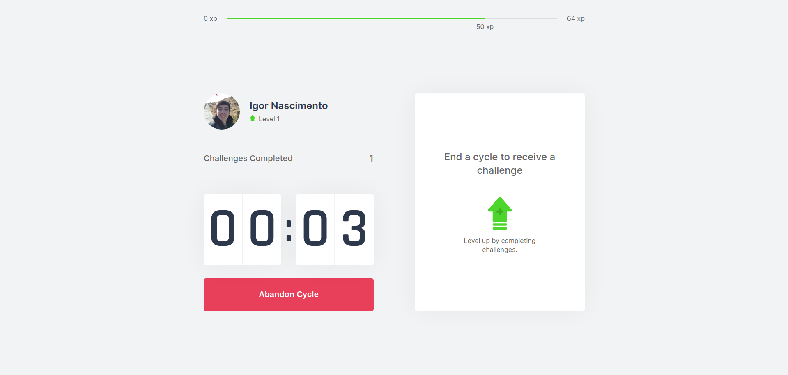

<h1 align="center">
  Welcome to the Move.it project repository!
</h1>

<p align="center"> Application developed in the fourth edition of Rocketseat Next Level Week 💻🚀 </p>

<h1 align="center">
<div style="display: flex; flex-direction: row;">
  
  
  <div>
  <div style="display: flex; flex-direction: row;">
  
  
  <div>
</h1>

---

## Objective

Track your time, be more productive and take care of your health. [Move.it](https://moveit-igorln.vercel.app/) was developed for time management, as in the pomodoro technique, dividing the work into 25 minute periods. After that time it releases a challenge, which is some stretching for the body or exercise for the eyes. Each challenge has its xp points and, accumulating the points you level up.

---

## Technologies

The following tools were used in the construction of the project:

- [ReactJS](https://reactjs.org)
- [NextJS](https://nextjs.org)
- [Yarn](https://yarnpkg.com/)
- [VSCode](https://code.visualstudio.com)
- [Git Bash](https://gitforwindows.org/)

---

## Installation of the project locally

After each of the steps, there will be an example of the command to be typed to do what is being asked, if you have difficulties and the example is not enough, do not hesitate to contact me at _igorln96@gmail.com_.

1. Open the terminal and create a directory in the location of your choice with the command **mkdir**:
``` javascript
   mkdir projects-igorln
```

2. Enter the directory you just created and then clone the project:
``` javascript
   cd projects-igorln
   git clone git@github.com:igorln/move-it.git
```

3. Access the project directory and then use the command **yarn** to install all necessary dependencies:
``` javascript
   cd move-it
   yarn
```

4. Finally, run the command **yarn dev** and access the project via browser, in the path `http://localhost:3000`.
